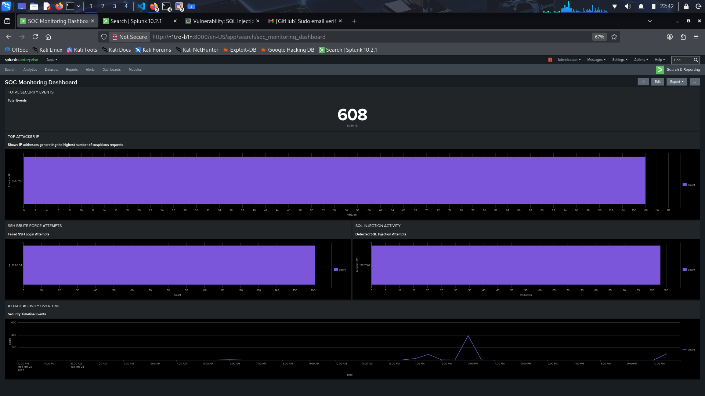

# SOC HOMELAB - SPLUNK SIEM

A hands-on Security Operations Center (SOC) homelab that simulates real-world cyber attacks and detects them using Splunk SIEM.

This project demonstrates an end-to-end security monitoring pipeline:

**Attack → Log Generation → Log Ingestion → Detection → Alerting → Visualization**

---

## Architecture


The lab simulates a real SOC environment:

* **Attacker Machine**: Kali Linux performing attacks
* **Target Systems**: Linux server (SSH logs), Windows endpoint (event logs)
* **Log Sources**: `/var/log/ssh.log`, `/var/log/web.log`, Windows Security Logs
* **SIEM**: Splunk Enterprise for log ingestion, parsing, and detection
* **Security Analyst**: Investigates alerts and monitors dashboards

---

## Technologies Used

* Splunk Enterprise (SIEM)
* Kali Linux
* DVWA (Damn Vulnerable Web Application)
* Hydra (Brute-force attack tool)
* Nmap (Network scanning)
* Linux SSH Logs
* Windows Event Logs

---

## Attack Simulation

### 1. Network Scanning (Nmap)

* **Command:**

  ```bash
  nmap -sS <target-ip>
  ```
* **Objective:** Discover open ports and services

---

### 2. SSH Brute-force Attack (Hydra)

* **Command:**

  ```bash
  hydra -l admin -P rockyou.txt ssh://<target-ip>
  ```
* **Objective:** Attempt unauthorized access via credential brute-force

---

### 3. SQL Injection (DVWA)

* **Payload:**

  ```sql
  ' OR '1'='1
  ```
* **Objective:** Bypass authentication and exploit web vulnerabilities

---

## Detection Engineering

### SSH Brute-force Detection

```spl
index=main "Failed password"
| rex "from (?<src>\d+\.\d+\.\d+\.\d+)"
| bin _time span=1m
| stats count by _time, src
| where count > 5
```

**Description:**
Detects multiple failed login attempts from a single IP address within a short time window, indicating a potential brute-force attack.

---

## Alerting

* **Trigger Condition:** Failed login attempts exceed threshold
* **Detection Type:** Real-time search
* **Action:** Email notification

**Purpose:**
Enable rapid incident response by notifying security analysts when suspicious activity is detected.

---

## Dashboard

The Splunk dashboard provides real-time visibility into security events:

* Failed login attempts over time
* Top attacking IP addresses
* Suspicious authentication activity



---

## Key Learnings

* Built an end-to-end SOC monitoring pipeline
* Performed real-world attack simulations
* Developed SPL detection queries
* Implemented alerting mechanisms in Splunk
* Gained hands-on experience with SIEM operations

---

## Future Improvements

* Add advanced detection rules (correlation-based detection)
* Integrate threat intelligence feeds
* Expand log sources (firewall, IDS/IPS)
* Build incident response playbooks

---

## Project Value

This project demonstrates practical skills required for a **SOC Analyst / Security Engineer** role, including:

* Log analysis
* Detection engineering
* SIEM configuration
* Threat detection and monitoring

---

## Author

**Bin Nguyen**

Security Engineering Enthusiast
