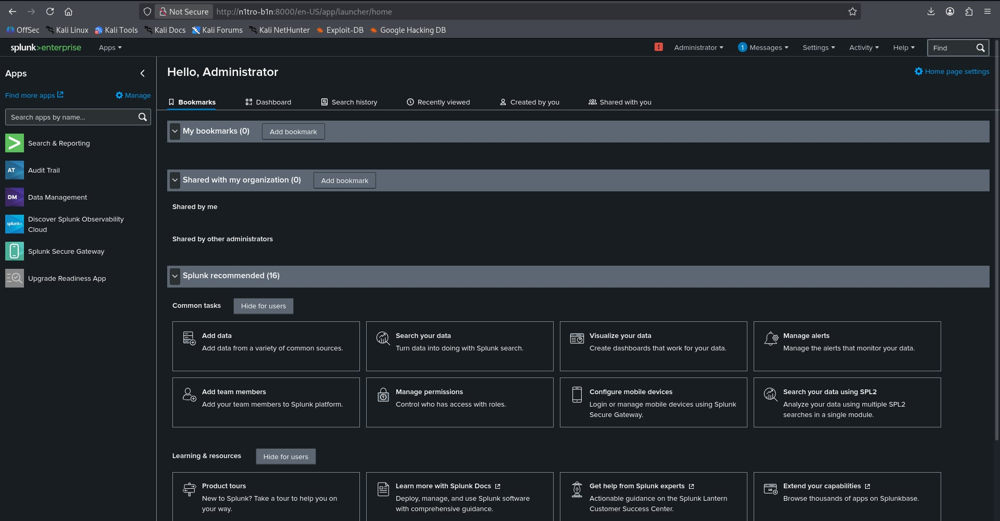
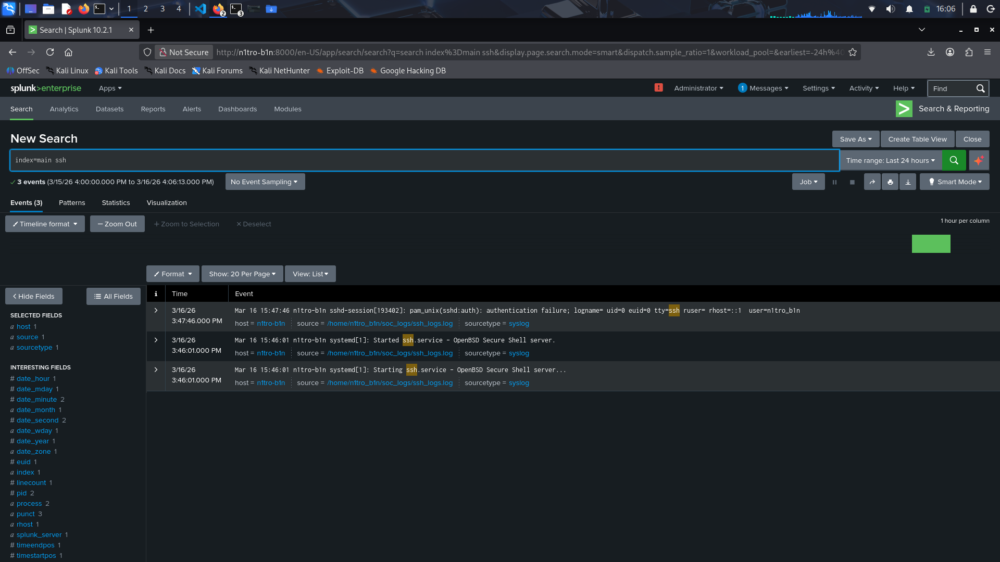

# SOC Homelab Architecture

## Overview

This homelab simulates a small enterprise SOC environment where logs from
multiple systems are centralized into a SIEM platform (Splunk) for
monitoring, detection, and incident investigation.

## Components

### Attacker Machine
Kali Linux used to simulate attacks such as:
- SSH brute force
- Port scanning
- Web attacks

### Linux Server
Ubuntu server generating logs such as:
- /var/log/auth.log
- SSH authentication events

### Windows Endpoint
Windows machine generating:
- Security Event Logs
- Login events
- PowerShell activity

### Splunk SIEM
Central log collection and analysis platform.

Functions:
- log ingestion
- detection rules
- dashboards
- incident investigation

## Splunk SIEM Dashboard

This screenshot shows the Splunk Enterprise SIEM successfully deployed on the SOC homelab server.

## Splunk SIEM SSH Ingestion

This screenshot shows the Splunk Enterprise SIEM add a SSH ingestion successfully deployed on the SOC homelab server.

