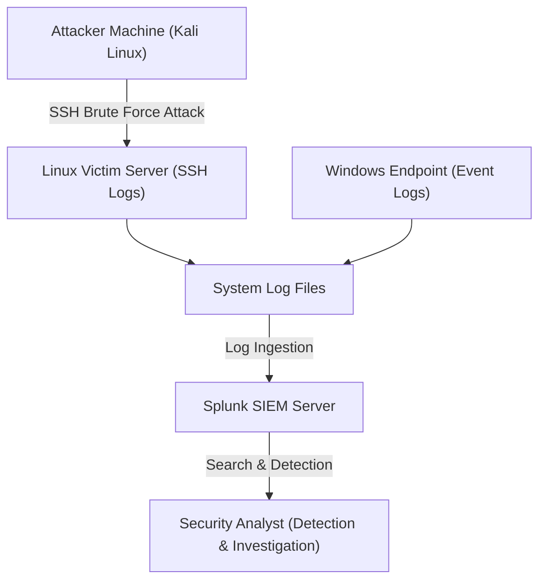

# SOC Homelab Architecture Diagram

```mermaid
flowchart TD

Attacker["Attacker Machine (Kali Linux)"]
Linux["Linux Victim Server (SSH Logs)"]
Windows["Windows Endpoint (Event Logs)"]
Logs["System Log Files"]
Splunk["Splunk SIEM Server"]
Analyst["Security Analyst (Detection & Investigation)"]

Attacker -->|SSH Brute Force Attack| Linux
Linux --> Logs
Windows --> Logs
Logs -->|Log Ingestion| Splunk
Splunk -->|Search & Detection| Analyst
```