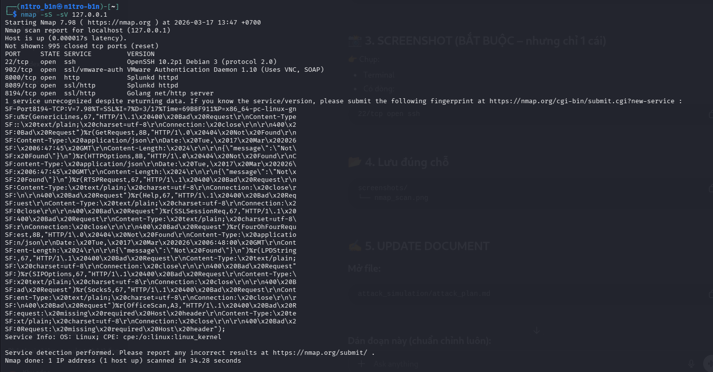
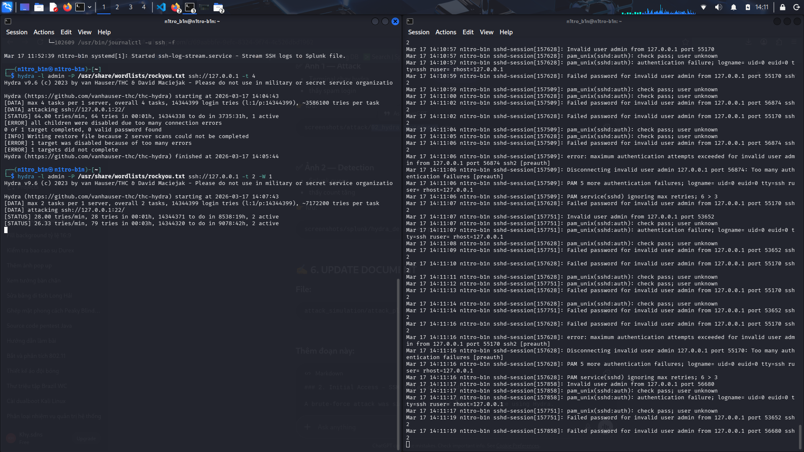
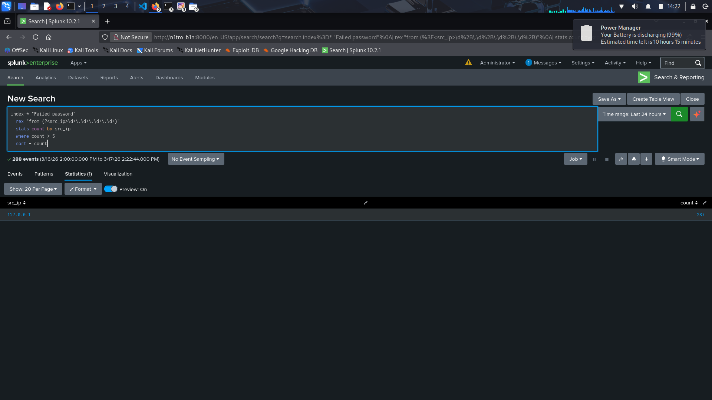
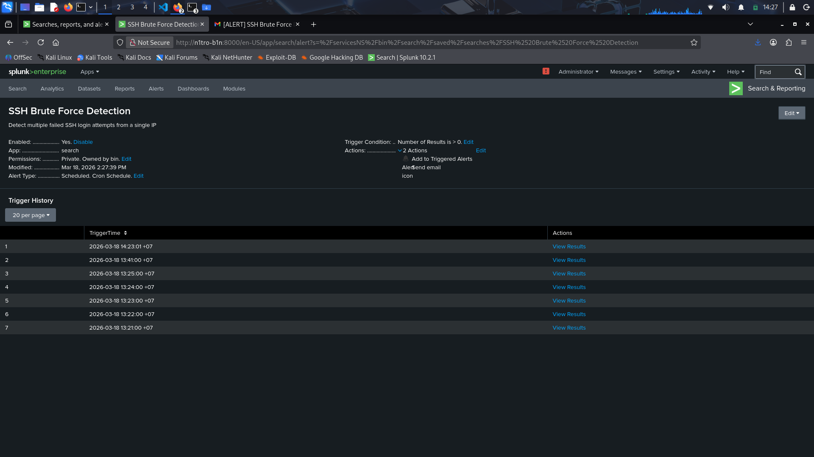
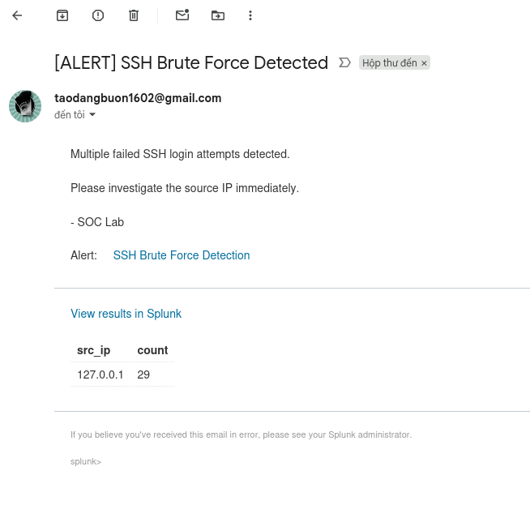
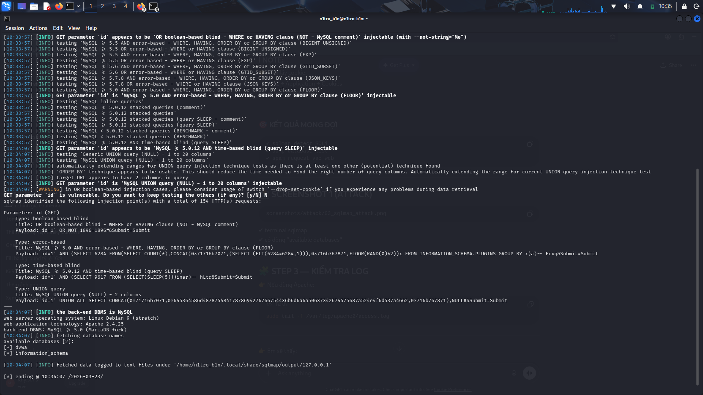
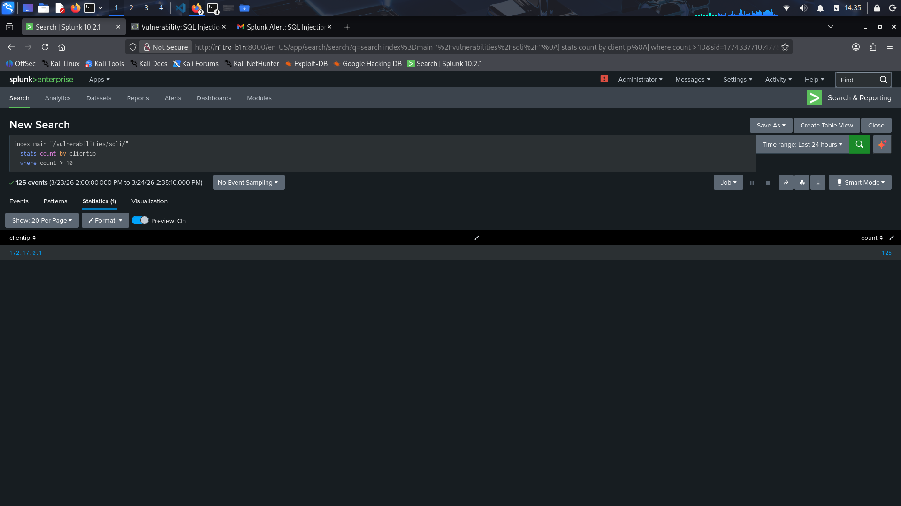
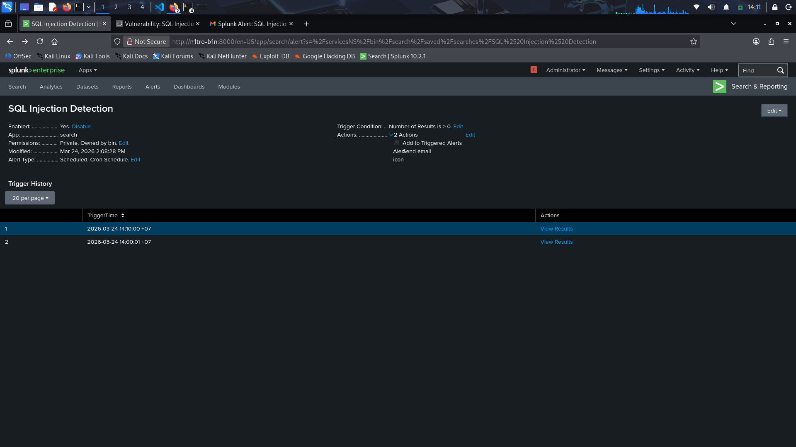

Attack Scenarios

1. Port scanning using nmap
2. SSH brute force using hydra
3. Web attack using sqlmap

### 1. Reconnaissance – Port Scanning (Nmap)

A TCP SYN scan was performed to identify open ports and services on the target system.

Command used:

```bash
nmap -sS -sV 127.0.0.1
```



### 2. Initial Access – SSH Brute Force (Hydra)

A brute-force attack was simulated against the SSH service using Hydra.

Command used:

```bash
hydra -l admin -P /usr/share/wordlists/rockyou.txt ssh://127.0.0.1 -t 2 -W 1
```

Result:

Multiple failed login attempts were generated

Logs were successfully ingested into Splunk in real-time

**Detection:**
```bash
index=* "Failed password"
| stats count by src
| where count > 5
```
This query identifies potential brute-force attacks by detecting repeated failed login attempts.

Evidence:


**Alerting**

A real-time alert was configured in Splunk:

Runs every 1 minute

Detects brute-force behavior based on threshold

Generates alert when condition is met

Evidence:




**Notification**

An email notification is sent when the alert is triggered.

Provides immediate visibility to SOC analyst

Includes attack details and source IP

Supports faster incident response

Evidence:



### 3. Web Attack – SQL Injection (SQLMap)

A SQL Injection attack was simulated against the DVWA web application using sqlmap.

Command used:

```bash
sqlmap -u "http://127.0.0.1:8080/vulnerabilities/sqli/?id=1&Submit=Submit" \
--cookie="security=low; PHPSESSID=xxx" \
--batch --level=3 --risk=2
```

Result:

Multiple malicious requests were sent to the web application

SQL Injection payloads were successfully executed

Web access logs were generated and streamed to Splunk in real-time



**Detection:**

```spl
index=main "/vulnerabilities/sqli/"
| stats count by clientip
| where count > 10
```

This query detects potential SQL Injection attacks by identifying a high number of requests from a single IP targeting the SQLi endpoint.

Evidence:



**Alerting**

A real-time alert was configured in Splunk:

Runs every 1 minute
Triggers when suspicious activity is detected
Uses suppression (60s) to avoid duplicate alerts
Groups alerts by clientip

Evidence:



**Notification**

An email notification is sent when the alert is triggered:

Contains attacker IP address
Includes number of suspicious requests
Helps SOC analyst quickly identify threats

Evidence:

1[Notification](../screenshots/splunk/sql_email_alert.png)